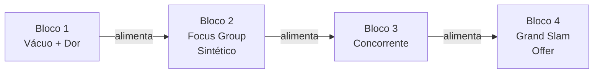

> **Para a instrutora (não lido ao vivo):** Esta abertura abre 4 horas de aula ao vivo. Energia precisa ser alta sem ser ansiosa. A turma chega com expectativa de "ferramenta nova"; o seu trabalho aqui é redirecionar para "método antes da ferramenta". Atenção a quem está no celular: o acordo de presença pede computador aberto. Tempo total: 15 minutos. Plano B se atrasar 3 min: cortar a parte do "como você vai anotar" (3 min).

> **A tese desta aula em uma frase.** Pesquisa antes da oferta: o jogo que se ganha antes do anúncio. Você vai sair daqui sabendo como usar IA para encontrar dor real que ninguém atende, simular o cliente antes de gastar em mídia, ler o concorrente em 15 minutos e empilhar uma oferta onde o preço some quando comparado ao valor. Sem ferramenta nova. Com método novo.

Você provavelmente já tentou criar oferta antes e viu que ela não vendeu como esperado, mesmo com produto bom. Ou está começando do zero, com uma ideia na cabeça e dúvida se já vale anunciar. Os dois lugares são normais. O que não é normal, e o que essa aula corrige, é seguir gastando em mídia antes de saber o que essa oferta de fato resolve no mundo real. A Alan Nicolas, que faturou mais de cem milhões de reais com isso, resume assim: a melhor dor já sangra no caixa antes da IA entrar.

## 01 · O hook (3 min)

Existe um padrão silencioso entre quem vende milhões com IA e quem queima verba sem retorno. Os que vendem fazem pesquisa antes da oferta. Os que queimam tentam oferta primeiro, pesquisa depois.

> **Pergunta reflexiva (lançar para a turma):** quem aqui já criou uma oferta, anunciou, e teve que reescrever tudo depois porque o cliente não respondia ao que você achou que ele queria?

A diferença não é orçamento. É ordem. A Alan diz que ela mesma quebrou empresas várias vezes invertendo a ordem. Uma vez investiu trezentos mil reais em design de produto antes de validar a dor. Resultado: estoque parado. Quando ela fez ao contrário, pesquisar primeiro, validar dor, empacotar oferta, vendeu mais de meio milhão de reais em um único dia de e-commerce.

Hoje, com IA, o jogo da pesquisa que demorava semanas cabe em horas. Isso muda quem pode entrar. Antes era para quem tinha equipe de pesquisa de mercado. Agora é para quem tem método.

## 02 · O mapa dos 4 blocos (5 min)

A aula tem 4 blocos de 50 minutos cada, mais intervalos. Cada bloco ensina uma tese, com dois ou três conceitos novos. Nada além disso.

| Bloco | Tese | O que você vai ter ao final |
| --- | --- | --- |
| 1 (50 min) | Vácuo e dor real vivem em lugares públicos invisíveis | Um nicho com dor mapeada com palavras literais do cliente |
| 2 (50 min) | Persona sintética testa mensagem com custo zero | Uma headline já testada em 3 personas antes de virar anúncio |
| 3 (50 min) | Concorrente se vê do alto em 4 vetores | Um dossiê de concorrente em posicionamento, preço, promessa e ângulo |
| 4 (50 min) | Empilhamento de valor faz o preço sumir | Uma oferta com nome, promessa, ancoragem e bônus prontos para vender |

Entre o bloco 1 e o 2: intervalo de 10 minutos. Entre o 2 e o 3: intervalo de 10 minutos. Entre o 3 e o 4: sem intervalo, porque o 3 alimenta o 4 diretamente.

> **Nota:** este formato é roteiro de aula ao vivo. Não é gravação para LMS. Você vai sair daqui com material para usar na sua empresa amanhã, não com curso para estudar depois.

## 03 · O acordo de presença (4 min)

Antes de começar o bloco 1, três combinações.

**Primeira: computador aberto.** Não é opcional. Cada bloco tem uma demonstração ao vivo com Claude e um exercício de 10 minutos onde você executa. Quem está só no celular vai aproveitar metade. Se você não tem Claude instalado, abre o Claude na web agora. Se você usa ChatGPT em vez disso, eu vou enviar depois o paralelo de cada prompt em GPT, mas hoje ao vivo a demo é no Claude.

**Segunda: anotação que funciona.** Cada bloco fecha com uma seção "Para o quadro" com 2 ou 3 frases que comprimem a tese do bloco. Anote essas frases. Não o conteúdo inteiro. Aluno que anota tudo esquece tudo. Aluno que anota a frase certa repete uma semana depois.

**Terceira: perguntas no momento certo.** Cada bloco fecha com 5 minutos de quiz e Q&A. Guarde as perguntas para esse momento, não interrompa a demonstração. Se a pergunta for urgente porque você travou no exercício, levanta a mão. Se for de aprofundamento, anota e pergunta no Q&A.

> **Pergunta reflexiva:** o que muda na sua próxima oferta se você passar 4 horas pesquisando antes de gastar um real em anúncio?

## 04 · Por que essa ordem importa (3 min)

A Alan tem uma fala que abre os olhos: você não vende IA. Você vende solução. IA é meio, como eletricidade ou internet. Ninguém compra eletricidade. Compra geladeira que conserva comida.

A consequência prática: pesquisa, oferta e venda estão na mesma cadeia. Se a pesquisa do bloco 1 sai mal feita, a persona do bloco 2 vira ficção, o concorrente do bloco 3 vira lista, e a oferta do bloco 4 vira preço chutado. Por isso os blocos têm ordem. Não pule.

Quem inverte essa ordem queima verba. Quem segue ganha tempo. A Alan resume em uma fórmula:

> **Dor cara mais solução simples mais pitch específico igual a contrato fechado.**

Bloco 1 e 2 são "dor cara" decomposta. Bloco 3 é o pitch específico. Bloco 4 é a solução empacotada. Os 4 são interdependentes.

## Para o quadro

> **Sobre a tese-mãe:** pesquisa antes da oferta. O jogo se ganha antes do anúncio.

> **Sobre a ordem:** dor cara mais solução simples mais pitch específico igual a contrato fechado.

> **Sobre IA:** você não vende IA. Vende solução. IA é meio, como eletricidade.

## Transição para o Bloco 1

> **Para a instrutora (frase-ponte para falar ao vivo):** "Agora que você sabe por que pesquisa vem antes de oferta, no próximo bloco a gente vai aprender onde a dor real mora. Não na sua cabeça. Em lugares públicos que ninguém olha. Bora."
