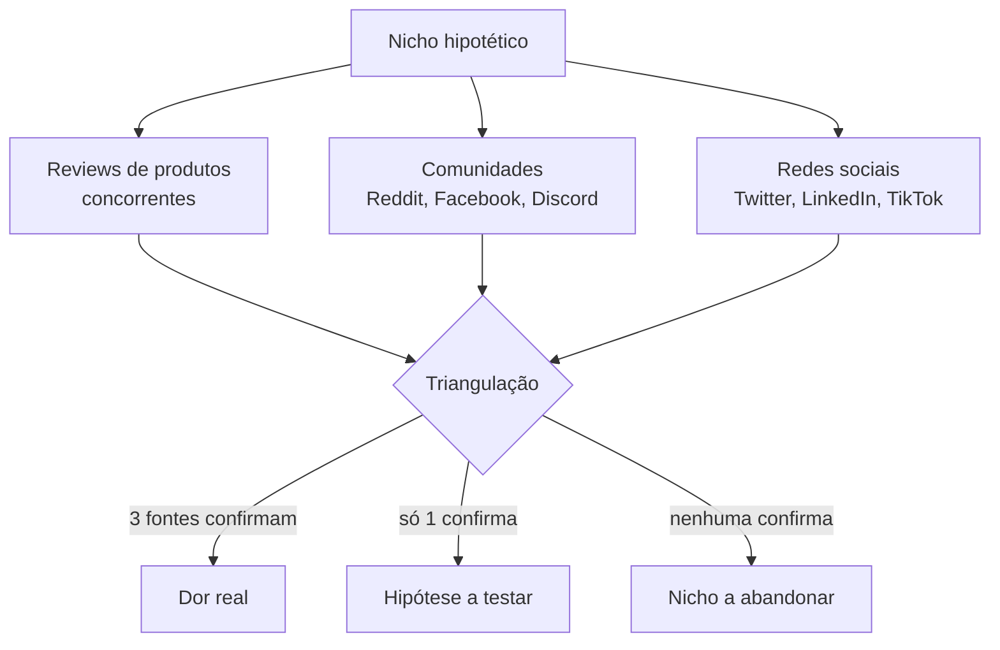

> **Para a instrutora (não lido ao vivo):** Bloco mais denso da aula. Energia precisa ser alta no começo (a turma acabou de ouvir a tese-mãe e quer ver o jogo). Monitorar: quem está só anotando, perguntar diretamente se conseguiu instalar o Claude. Plano B se atrasar 5 min: cortar a segunda demo (Perplexity) e mandar como envio pós-aula. Demo principal é a do Claude com reviews.

> **A tese deste bloco.** Dor cara não está na sua cabeça. Está em review de cliente bravo, em comentário irritado de comunidade do Facebook, em thread esquecida do Reddit. Você vai sair daqui com um protocolo de 3 fontes que, somadas, devolvem a frase exata que seu cliente usa para descrever o problema. Essa frase é a matéria-prima de tudo que vem depois. Sem ela, a oferta do bloco 4 vira chute.

Você provavelmente já tentou pensar em uma dor de cliente sozinho, no chuveiro, e achou que tinha encontrado. Ou olhou pesquisa de mercado paga que falava de "tendências do setor" e saiu com nada concreto. Os dois caminhos falham porque ignoram que a dor real vive em texto público de gente bravo. E IA lê texto rápido.

## Microestrutura deste bloco

```text
00-15 min  Teoria: 4 critérios da dor cara mais protocolo de triangulação
15-35 min  Demo ao vivo: minerar reviews de 1 produto com Claude
35-45 min  Exercício em tela: você minera 1 nicho (2 níveis)
45-50 min  Quiz oral mais Q&A
```

## 01 · Teoria: o que é dor cara (15 min)

A Alan tem um critério que separa dor que vende de dor que não vende: a dor cara já sangra no caixa antes da IA entrar. Traduzindo: a pessoa já sabe que está perdendo dinheiro com aquilo, antes de você aparecer com solução. Você não precisa convencer que a dor existe. Ela já existe.

Quatro critérios decidem se uma dor é cara:

1. **Frequência alta.** Acontece toda semana, todo mês. Não é evento raro. Quanto mais frequente, mais doi acumulado.
2. **Custo visível.** Quantificável em reais ou em tempo. A Alan dá um caso real: uma franquia gastando vinte mil por semana só para enviar documentação. Vinte mil é número. Número convence.
3. **Quem sente controla orçamento.** Não adianta a dor existir se quem sente não decide compra. O gerente sente, mas quem aprova é o diretor. A dor precisa estar nas mãos de quem assina.
4. **Dor escrita com palavras literais do cliente.** Não é como você descreve. É como ele descreve. "Perdi cliente porque ninguém respondeu em 2 horas" é palavra de cliente. "Otimização de SLA de atendimento" é palavra sua.

> **Pergunta reflexiva:** pensa em uma dor que você acha que seu cliente tem. Você consegue completar essas 4 caixas com dados reais? Se não, você ainda não tem dor cara. Tem hipótese.

### O problema da sua cabeça

A maior armadilha em pesquisa de dor é confiar na sua intuição. Você acha que sabe a dor do cliente porque vive próximo dele. Mas você ouve o que ele te diz na sua frente. Não ouve o que ele escreve quando está bravo, sozinho, num review de produto às 2 da manhã.

A Alan resume assim: dor real não é o que ele te conta no almoço. É o que ele escreve quando ninguém está olhando.

### O protocolo de triangulação

Uma fonte só mente. Duas fontes sugerem. Três fontes confirmam. Por isso o protocolo é:



A IA acelera porque lê mil reviews em minutos. Você lê em dias. Mas a leitura sozinha não serve. Você precisa de protocolo que extrai palavras, frequência e contexto.

> **Nota:** os dados de mercado que a Alan cita (oitenta por cento de líderes usando IA semanalmente, oitenta por cento de projetos internos de IA falhando) ela apresenta sem fonte primária. Apresento aqui como narrativa que ela conta, não como fato auditável. O que é fato verificado é o caso dela: uma franquia gastando vinte mil por semana com documentação.

## 02 · Demo ao vivo com Claude (20 min)

> **Para a instrutora:** abra Claude na web em janela limpa, projetada. Eu vou colar três prompts encadeados. Comente enquanto o modelo responde. A demo total é 18 minutos, sobra 2 para perguntas curtas se houver.

Vamos minerar dor real do nicho **escritórios de contabilidade brasileiros**. Esse nicho a Alan menciona como exemplo. Hoje vamos extrair as palavras literais que esses escritórios usam quando estão bravos.

### Prompt 1: extrair temas recorrentes de reviews

```text
Você é um analista de mercado especializado em mineração de dor. Eu vou colar abaixo trechos de reviews públicos de softwares usados por escritórios de contabilidade no Brasil. Sua tarefa:

1. Identifique os 5 temas de dor mais recorrentes nos reviews
2. Para cada tema, extraia 3 citações VERBATIM (palavras literais do cliente, sem reescrita)
3. Para cada tema, estime o custo visível (em horas perdidas ou em reais) quando o cliente mencionar
4. Classifique cada tema por frequência (alta, média, baixa)

Formato de saída: tabela com colunas Tema, Citações verbatim, Custo visível, Frequência.

[colar aqui de 20 a 50 reviews encontrados em sites como reclameaqui, b2b stack, capterra]
```

**Output esperado:** uma tabela com 5 temas, cada um com 3 frases literais e número de custo. Os temas mais comuns nesse nicho costumam ser: lentidão para responder cliente, perda de prazo fiscal, retrabalho com documento, dificuldade de bater valores entre sistemas.

**O que comentar enquanto o modelo responde (5 a 15 segundos):** "Repare que estou pedindo VERBATIM. Sem isso, o modelo parafraseia e perde a palavra do cliente. Palavra do cliente é matéria-prima."

### Prompt 2: cruzar com comunidades

```text
Agora vou colar trechos de discussões em grupos de Facebook e Reddit onde contadores discutem essas dores entre si (sem estar avaliando produto, só conversando). Sua tarefa:

1. Para cada um dos 5 temas que você identificou no prompt anterior, marque quais aparecem também nessas discussões
2. Identifique 2 temas NOVOS que aparecem em comunidade mas não apareceram em review (isso indica dor que ninguém vende solução ainda)
3. Para cada tema novo, extraia 2 citações verbatim

[colar aqui de 10 a 30 mensagens de comunidade]
```

**Output esperado:** confirmação ou refutação dos 5 temas anteriores, mais 2 temas inéditos que viraram candidatos a vácuo de mercado.

**O que comentar:** "Esse cruzamento é o segredo. O que está em review é dor que o mercado já tenta resolver. O que está em comunidade mas não em review é dor sem solução. É vácuo."

### Prompt 3: extrair a frase-mestre

```text
Com base nos dois prompts anteriores, escolha A DOR mais frequente, mais cara, e que aparece com palavras consistentes em todas as fontes. Para essa dor, me devolva:

1. A frase exata como o cliente escreve (verbatim, na 1ª pessoa)
2. O custo médio em reais ou horas
3. A frequência (quantas vezes por mês)
4. Quem na empresa controla o orçamento para resolver essa dor
5. Se essa dor passa nos 4 critérios da dor cara: frequência alta, custo visível, controle de orçamento, palavras literais
```

**Output esperado:** uma frase única na voz do cliente, com 4 critérios verificados. Essa frase vira a tese da oferta no bloco 4.

### Material para envio pós-aula (Codex / GPT)

Os mesmos 3 prompts adaptados para GPT, prontos para a turma que usa ChatGPT:

```text
Atue como analista sênior de mineração de dor de mercado. Vou colar reviews. Devolva tabela com: Tema, 3 citações verbatim (textuais), Custo visível em R$ ou horas, Frequência (alta/média/baixa). Não parafraseie citações.

[colar reviews]
```

```text
Continuando a análise: cruzar os 5 temas com discussões de comunidade abaixo. Marcar quais se confirmam e identificar 2 temas inéditos (que existem em comunidade mas não em review = vácuo de oferta). Citações verbatim de cada tema inédito.

[colar comunidade]
```

```text
Sintetizar A dor única: frase do cliente em 1ª pessoa, custo médio (R$ ou horas), frequência mensal, decisor de orçamento, e verificação dos 4 critérios da dor cara.
```

> **Diferença da versão Claude:** o GPT tende a parafrasear mais, por isso o reforço "não parafraseie citações" é mais firme no prompt 1. No Claude, o pedido de verbatim costuma ser respeitado de primeira.

## 03 · Exercício em tela (10 min)

> **Para a instrutora:** anuncie os dois níveis. Dê 8 minutos para fazer. Caminhe pela sala. Peça para 1 aluno mostrar (2 min).

### Nível iniciante

**Tarefa:** escolha um nicho que você já conhece (o seu, ou o do seu cliente). Cole no Claude o prompt 1 com 5 reviews que você encontre no Reclame Aqui em 3 minutos. Receba a tabela.

```text
Você é um analista de mineração de dor. Vou colar 5 reviews públicos do meu nicho. Tarefa: 3 temas mais recorrentes, 2 citações verbatim por tema, frequência de cada um (alta/média/baixa).

[colar 5 reviews]
```

**Output esperado:** tabela com 3 temas, 6 citações verbatim, frequência marcada. Você sabe que funcionou quando consegue ler uma citação em voz alta e ela soa como cliente bravo de verdade, não como descrição corporativa.

### Nível intermediário

**Tarefa:** rode os 3 prompts em sequência no Claude com material que você levantou em 8 minutos (reviews mais comunidade mais redes). Chegue na frase-mestre. Verifique se passa nos 4 critérios.

```text
[template adaptável: ajustar nicho, quantidade de reviews e canais escolhidos]
```

**Critério de qualidade:** a frase-mestre, lida em voz alta, soa como cliente. Tem número de custo. Tem decisor identificado. Se você sair com "preciso melhorar atendimento", você ainda não terminou. Se sair com "perdi três clientes esse mês porque levei mais de duas horas para responder e o sócio está me cobrando isso na reunião de sexta", você terminou.

## 04 · Quiz oral mais Q&A (5 min)

> **Para a instrutora:** lance as 3 perguntas. Espere 10 segundos. Convide 1 pessoa a responder antes de revelar.

```quiz
question: "Você está minerando dor no nicho de clínicas odontológicas. Sua IA devolve 'os clientes querem mais qualidade no atendimento'. Qual o defeito desse output?"
options:
  - id: a
    text: "O output está correto, é só pedir mais detalhes."
    feedback: "O defeito é mais grave. A frase é genérica, sem custo, sem decisor, sem verbatim. Não passa em 3 dos 4 critérios da dor cara. Mais detalhes não resolvem, o prompt precisa ser refeito exigindo verbatim e custo quantificado."
    rationale: "Aluno acha que aceitar output vago é só questão de iterar, não percebe que o prompt falhou na origem."
  - id: b
    text: "A IA não pediu palavras verbatim do cliente, então parafraseou. Precisa refazer o prompt exigindo citações literais e custo em reais ou tempo."
    correct: true
    feedback: "Exato. Verbatim é a matéria-prima. Quando o prompt não pede explicitamente, o modelo parafraseia por default e você perde a voz do cliente. Sempre exigir verbatim e quantificação."
  - id: c
    text: "O nicho de clínicas odontológicas não tem reviews públicos suficientes."
    feedback: "Improvável. Reclame Aqui, Google Reviews e grupos de Facebook de pacientes têm volume alto nesse nicho. O problema está no prompt, não na disponibilidade de dados."
    rationale: "Aluno culpa o nicho quando o problema é o método."
```

```quiz
question: "Dos 4 critérios da dor cara, qual é o que mais separa hipótese de dor real?"
options:
  - id: a
    text: "Frequência alta."
    feedback: "Importante, mas insuficiente. Dor frequente sem decisor de orçamento não vende. Frequência conta, mas não isola hipótese de realidade."
    rationale: "Aluno escolhe o critério mais óbvio, sem perceber que ele isolado não basta."
  - id: b
    text: "Custo visível."
    feedback: "Quase. Custo visível é poderoso porque convence, mas sem ele estar nas mãos de quem decide compra, vira só conversa. O critério mais separador é o próximo."
    rationale: "Aluno valoriza quantificação mas esquece quem assina."
  - id: c
    text: "Quem sente controla orçamento."
    correct: true
    feedback: "Sim. Dor que vende é dor que está nas mãos de quem assina cheque. Frequência e custo são necessários, mas sem controle de orçamento a dor não vira contrato. É o critério que mais elimina nichos falsos."
```

```quiz
question: "Você cruzou reviews, comunidades e redes. Encontrou um tema que aparece em comunidade mas não em review. O que isso significa?"
options:
  - id: a
    text: "Significa que o tema é irrelevante, porque ninguém reclama em review."
    feedback: "O contrário. Se não está em review é porque ninguém vende solução para isso ainda. Cliente só reclama em review depois de comprar. Sem produto no mercado, não há review. É vácuo, não irrelevância."
    rationale: "Aluno confunde ausência de review com ausência de demanda."
  - id: b
    text: "Significa que provavelmente existe vácuo de oferta nesse tema, candidato forte para oferta nova."
    correct: true
    feedback: "Sim. Tema em comunidade sem review correspondente é sinal de dor real sem solução comprável. É o ouro do protocolo de triangulação. A próxima etapa é validar com prompt 3 se essa dor passa nos 4 critérios."
  - id: c
    text: "Significa que o tema é experimental e precisa de pesquisa quantitativa para validar."
    feedback: "Não. Pesquisa quantitativa custa caro e demora. O caminho mais barato é validar com persona sintética (bloco 2) antes de qualquer pesquisa formal."
    rationale: "Aluno default para pesquisa acadêmica quando o caminho é teste rápido."
```

### Q&A guiado (perguntas prováveis da plateia)

> **Para a instrutora:** se a plateia perguntar uma destas, você já tem resposta de 30 segundos preparada.

- **P:** "E se meu nicho não tem reviews em português suficientes?"
  **R (30s):** Use reviews em inglês de produtos equivalentes e peça ao Claude para traduzir mantendo o tom emocional. Comunidades brasileiras (Facebook, Discord) cobrem o que falta. Sempre cruze pelo menos 2 idiomas se o nicho for B2B internacional.

- **P:** "Quantos reviews preciso colar no prompt 1?"
  **R (30s):** Entre 20 e 50. Abaixo de 20, a IA fica enviesada por outliers. Acima de 50, você gasta token sem ganho de qualidade. 30 é o sweet spot.

- **P:** "E se o cliente final do meu negócio nunca escreve em público?"
  **R (30s):** Então o protocolo muda: você minera quem vende para esse cliente (consultores, fornecedores, ex-funcionários no LinkedIn). A dor aparece em quem está perto do cliente, não no cliente direto.

## Para o quadro

> **Sobre a dor cara:** ela já sangra no caixa antes da IA entrar. Quatro critérios: frequência, custo visível, controle de orçamento, palavras literais.

> **Sobre triangulação:** reviews mais comunidades mais redes. Uma fonte mente, duas sugerem, três confirmam.

> **Sobre verbatim:** dor real não é o que ele te conta no almoço. É o que ele escreve quando ninguém está olhando.

## Transição para o próximo bloco

> **Para a instrutora (frase-ponte para falar ao vivo):** "Agora que você tem a frase do cliente, no próximo bloco a gente vai usar essa frase para criar persona sintética e testar mensagem antes de gastar um real em mídia. Bora para o intervalo de 10 minutos. Volta às {tempo}."

## Checklist pré-bloco

- [ ] Claude aberto em janela limpa, projetada
- [ ] 50 reviews do nicho da demo carregados no clipboard
- [ ] 30 mensagens de comunidade prontas
- [ ] Material Codex/GPT pronto para envio pós-aula
- [ ] Cronômetro visível
