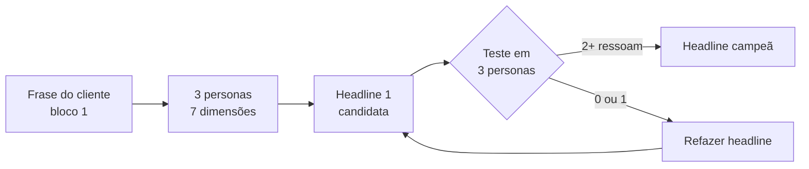

> **Para a instrutora (não lido ao vivo):** A turma volta do intervalo. Reabertura com energia média-alta. Este bloco é o mais conceitualmente novo: persona sintética como focus group ainda é desconhecido para a maioria. Faça uma micro-recapitulação no começo (30 segundos) puxando da frase-mestre do bloco 1. Plano B se atrasar 5 min: cortar o teste em 3 personas, testar em 1 só ao vivo, mandar o protocolo de 3 como envio pós-aula.

> **A tese deste bloco.** Antes de testar headline com anúncio pago, teste com persona sintética. Custo: zero. Tempo: 10 minutos. A Alan resume a era da IA como era da hiperpersonalização. Você vai sair daqui com uma headline já testada contra 3 perfis comportamentais diferentes do seu cliente, sabendo qual ressoa e por quê, antes de gastar um real em Meta Ads ou Google Ads.

Você provavelmente já criou headline que parecia genial e morreu na entrega. Ou rodou anúncio que teve clique mas zero conversão. O motivo quase sempre é o mesmo: a headline foi testada na sua cabeça, não na cabeça do cliente. Focus group tradicional resolve isso, mas custa caro e demora semanas. Focus group sintético resolve em 10 minutos por zero reais, se você souber construir.

## Microestrutura deste bloco

```text
00-15 min  Teoria: 7 dimensões da persona sintética
15-35 min  Demo ao vivo: criar 3 personas e testar 1 headline com Claude
35-45 min  Exercício em tela: você testa sua headline (2 níveis)
45-50 min  Quiz oral mais Q&A
```

## 01 · Teoria: 7 dimensões da persona sintética (15 min)

A Alan diz que o Avatar é o coração do livro da oferta. O avatar alimenta a solução. A história empacota tudo. Ela cita usar 134 sistemas de mapeamento de personalidade, com Eneagrama entre eles. O ponto: persona rasa não testa nada. Persona profunda testa mensagem.

Sete dimensões fazem persona sintética virar focus group de verdade:

1. **Demografia** (idade, profissão, renda, geografia). É a casca. Sem o resto, vira ficção.
2. **Psicografia** (valores, medos, ambições). É o motor. Define o que motiva e o que paralisa.
3. **Comportamento atual** (o que faz hoje sobre o problema, mesmo que mal feito). Define o ponto de partida real.
4. **Voz e vocabulário** (palavras que usa, expressões, o que NÃO diz). Define se a mensagem soa familiar.
5. **Objeções típicas** (o que vai contra-argumentar). Define o que a headline precisa antecipar.
6. **Contexto de leitura** (onde lê, em que estado emocional, com que tempo). Define o formato da mensagem.
7. **Padrão de decisão** (rápido ou lento, sozinho ou em grupo, racional ou emocional). Define o gatilho.

Persona com menos de 7 dimensões é caricatura. Persona com 7 dimensões é interlocutor que responde de forma previsível.

> **Pergunta reflexiva:** sua persona atual cobre as 7 dimensões, ou para na demografia? Se para na demografia, ela não é capaz de te dizer se uma headline funciona.

### Por que 3 personas e não 1

Cliente real não é uma pessoa. É 3 a 5 perfis comportamentais diferentes que compram pela mesma dor por motivos diferentes. A Alan mostra isso quando descreve criar avatares animais para cada perfil comportamental do site dela.

Três personas testam:
- O **decisor racional** (quer ROI claro, número, prova)
- O **decisor emocional** (quer segurança, identidade, pertencimento)
- O **decisor pragmático** (quer simplicidade, rapidez, sem fricção)

A mesma headline ressoa diferente nos 3. Sua headline campeã é a que ressoa em pelo menos 2 dos 3 sem ofender o terceiro.

### Protocolo de teste de mensagem



O ciclo dura 10 minutos no Claude. Você pode rodar 5 versões de headline em uma hora. Comparado com teste pago em Meta Ads (1 semana, mil reais para descobrir o que não funciona), é vantagem absurda.

> **Nota:** persona sintética não substitui pesquisa com cliente real. Substitui o teste cego. Você ainda precisa do bloco 1 com palavra verbatim de cliente para alimentar a persona. Sem isso, a persona vira ficção que diz o que você quer ouvir.

## 02 · Demo ao vivo com Claude (20 min)

> **Para a instrutora:** abra Claude em janela limpa. Vou colar 2 prompts encadeados. A demo precisa caber em 18 minutos.

Vamos pegar a frase-mestre do bloco 1 (a do escritório de contabilidade) e construir 3 personas, depois testar 1 headline.

### Prompt 1: criar 3 personas a partir da frase do cliente

```text
Você é um pesquisador comportamental especializado em criar personas sintéticas profundas. Vou te dar uma frase verbatim de cliente do nicho de escritórios de contabilidade brasileiros. Sua tarefa: criar 3 personas distintas que poderiam ter dito essa frase, cada uma representando um perfil decisório diferente: decisor racional, decisor emocional, decisor pragmático.

Frase verbatim: "Perdi três clientes esse mês porque a equipe demorou mais de duas horas para responder. O sócio está me cobrando na reunião de sexta."

Para cada persona, preencha as 7 dimensões:
1. Demografia (nome, idade, cargo, faturamento do escritório, cidade)
2. Psicografia (3 valores, 3 medos, 3 ambições)
3. Comportamento atual (o que faz hoje sobre essa dor, mesmo mal feito)
4. Voz e vocabulário (5 expressões que usa, 3 que NÃO usa)
5. Objeções típicas (3 contra-argumentos que dará a qualquer proposta)
6. Contexto de leitura (onde, quando, em que estado lê seu anúncio)
7. Padrão de decisão (rápido ou lento, sozinho ou em grupo, racional ou emocional)

Formato: tabela com 3 colunas (uma por persona), 7 linhas (uma por dimensão).
```

**Output esperado:** tabela com 3 personas vivas. Você sabe que funcionou quando consegue ler em voz alta qualquer linha e ouve voz diferente em cada coluna.

**O que comentar enquanto o modelo responde:** "Repare que estou dando a frase do bloco 1 como ancoragem. Sem essa frase, o Claude inventa persona genérica. Com essa frase, ele constrói persona que poderia ter dito aquilo."

### Prompt 2: testar 1 headline contra as 3 personas

```text
Agora você vai assumir o papel de cada uma das 3 personas, uma por vez, e reagir a esta headline candidata como se ela aparecesse no LinkedIn ou Google Ads para você:

Headline candidata: "Reduza em 80% o tempo de resposta do seu escritório sem contratar mais ninguém"

Para cada uma das 3 personas:
1. Reação imediata em uma frase (na voz da persona, primeira pessoa)
2. O que chamou atenção (positivo)
3. O que gerou objeção ou desconfiança
4. Probabilidade de clicar de 0 a 10
5. O que precisaria mudar na headline para subir essa nota em 3 pontos

Sintetize no final: a headline ressoou em quantas das 3 personas? Qual versão refinada você recomenda testar a seguir?
```

**Output esperado:** 3 reações distintas, com nota e sugestão de refino. A última linha sintetiza se a headline merece ir para mídia paga ou precisa de mais uma volta.

**O que comentar:** "Veja como o Claude simula a voz de cada persona. O decisor racional questiona o '80 por cento'. O decisor emocional reage ao 'sem contratar'. O decisor pragmático mede tempo de implementação. Três objeções diferentes na mesma headline."

### Material para envio pós-aula (Codex / GPT)

Os 2 prompts adaptados para GPT:

```text
Crie 3 personas sintéticas distintas (decisor racional, emocional, pragmático) a partir da frase verbatim abaixo, preenchendo: demografia, psicografia (3 valores, 3 medos, 3 ambições), comportamento atual, voz e vocabulário (5 frases usadas, 3 não usadas), objeções típicas (3), contexto de leitura, padrão de decisão. Saída em tabela.

Frase verbatim: "[colar frase do bloco 1]"
```

```text
Assuma o papel de cada uma das 3 personas e reaja à headline abaixo: reação em 1 frase (1ª pessoa), o que chamou atenção, o que gerou objeção, nota de 0 a 10 de probabilidade de clicar, sugestão para subir 3 pontos. Síntese final: em quantas personas a headline ressoou? Qual refino testar?

Headline: "[colar headline]"
```

> **Diferença da versão Claude:** o GPT precisa de reforço explícito de "1ª pessoa" para entrar no papel da persona; sem isso, ele descreve a reação em 3ª pessoa e perde o teste.

## 03 · Exercício em tela (10 min)

> **Para a instrutora:** anuncie os 2 níveis. 8 minutos para fazer, 2 para mostrar.

### Nível iniciante

**Tarefa:** pegue a frase do cliente que você minerou no exercício do bloco 1 (ou use a do escritório de contabilidade). Cole no Claude o prompt 1 com pequena adaptação. Receba a tabela.

```text
Crie 3 personas sintéticas (decisor racional, emocional, pragmático) a partir da frase abaixo. Para cada uma, preencha demografia básica, 3 valores, 3 medos e 3 expressões que ela usa.

Frase: "[colar sua frase]"
```

**Output esperado:** 3 colunas com personas distintas. Você sabe que funcionou se conseguir reconhecer o cliente seu em pelo menos uma das colunas.

### Nível intermediário

**Tarefa:** crie as 3 personas completas (7 dimensões), escreva 1 headline candidata para sua oferta, e rode o teste no Claude. Refine a headline com a sugestão e teste de novo.

```text
[template completo: adaptar frase do cliente, escrever headline candidata, rodar 2 prompts em sequência]
```

**Critério de qualidade:** sua headline final ressoa em pelo menos 2 das 3 personas (nota maior ou igual a 7 em pelo menos 2 colunas). Se ressoa em só 1, você ainda não tem headline pronta para mídia. Se ressoa em 3, atenção: pode estar genérica demais.

## 04 · Quiz oral mais Q&A (5 min)

```quiz
question: "Você criou uma persona com demografia detalhada (45 anos, contadora, São Paulo, R$ 200 mil de faturamento) mas testa uma headline e a persona responde de qualquer jeito, sem voz própria. Qual o defeito?"
options:
  - id: a
    text: "A demografia está incompleta, precisa adicionar mais detalhes como hobbies e formação."
    feedback: "Demografia não é o problema. O problema é a falta das outras 6 dimensões: psicografia, voz, objeções, contexto, padrão de decisão. Persona com só demografia é caricatura, não interlocutor."
    rationale: "Aluno acha que mais demografia resolve, sem perceber que está faltando o motor psicológico."
  - id: b
    text: "A persona está com 1 dimensão das 7. Sem psicografia, voz, objeções, contexto e padrão de decisão, ela não tem como reagir de forma previsível."
    correct: true
    feedback: "Sim. Demografia é a casca. Sem as outras 6 dimensões, o Claude precisa inventar reação, e inventa de forma genérica. As 7 dimensões juntas é que fazem a persona reagir como um cliente real reagiria."
  - id: c
    text: "O Claude não consegue simular personas, precisa de modelo especializado em pesquisa comportamental."
    feedback: "Não. O Claude simula bem desde que receba contexto suficiente. O problema é input, não modelo."
    rationale: "Aluno culpa o modelo quando o problema é a instrução."
```

```quiz
question: "Sua headline ressoou nas 3 personas com notas 9, 8, 9. O que isso significa?"
options:
  - id: a
    text: "A headline está pronta para mídia paga, pode escalar imediatamente."
    feedback: "Atenção. Headline que ressoa nos 3 perfis pode estar genérica demais, com promessa ampla que não compromete. Vale checar se ela diz algo específico ou se é universal. Se for específica e ressoar nos 3, ótimo. Se for universal, suspeite."
    rationale: "Aluno toma resultado bom como definitivo, sem questionar."
  - id: b
    text: "A headline está boa, mas suspeitar de genérico. Comparar com headline mais específica para ver se a nota cai ou se mantém."
    correct: true
    feedback: "Exato. Headline excelente em 3 perfis pode ser sinal de excelência ou de genérico. O teste é comparar com versão mais específica: se a específica cai muito, a primeira era genérica. Se a específica mantém ou supera, era excelente mesmo."
  - id: c
    text: "Ressonância nos 3 é sinal de que as personas estão mal construídas, todas iguais."
    feedback: "Improvável se você seguiu as 7 dimensões. Mais provável é a headline ser genérica do que as personas serem idênticas."
    rationale: "Aluno desconfia da ferramenta quando o sinal é da headline."
```

```quiz
question: "Você está fazendo teste de headline para um produto B2B de alto ticket (R$ 50 mil). Qual das 3 personas você precisa que ressoe mesmo se as outras 2 não ressoarem?"
options:
  - id: a
    text: "Decisor emocional. Compras de alto ticket são emocionais no final."
    feedback: "Em B2C de alto ticket pode ser. Em B2B de 50 mil reais, raramente. O decisor de B2B alto ticket é tipicamente racional, com aprovação em comitê, exigindo prova quantitativa."
    rationale: "Aluno generaliza compra emocional para qualquer alto ticket."
  - id: b
    text: "Decisor racional. B2B de alto ticket exige ROI claro, prova e justificativa quantitativa."
    correct: true
    feedback: "Sim. B2B de 50 mil reais passa por comitê, exige business case, e quem assina precisa defender a decisão internamente. Sua headline precisa carregar prova suficiente para o decisor racional vencer a aprovação. Os outros 2 perfis podem influenciar, mas o racional é o gate."
  - id: c
    text: "Decisor pragmático. Alto ticket exige simplicidade na implementação."
    feedback: "Importante na entrega, mas não no clique. O pragmático fecha contrato, mas quem aprova orçamento é o racional."
    rationale: "Aluno confunde fase de decisão com fase de execução."
```

### Q&A guiado

- **P:** "Posso usar a mesma persona sintética para vários produtos do mesmo nicho?"
  **R (30s):** Pode reusar a base demográfica e psicográfica. Mas as objeções e o contexto mudam por produto. Sempre ajuste essas duas dimensões antes de testar headline nova.

- **P:** "Como saber se a persona sintética está enviesada pelo que eu queria ouvir?"
  **R (30s):** Teste com headline propositalmente ruim. Se a persona disser nota alta para uma headline obviamente fraca, ela está enviesada. Refaça com vocabulário e objeções mais críticas.

- **P:** "Vale testar com 1 persona só se o nicho for muito específico?"
  **R (30s):** Não. Mesmo nicho específico tem 3 perfis decisórios diferentes. Use 3 sempre. O que muda em nicho específico é o vocabulário das 3, não o número.

## Para o quadro

> **Sobre persona profunda:** sete dimensões fazem persona virar interlocutor. Menos que sete vira caricatura.

> **Sobre teste:** três personas, uma headline. Se ressoar em duas das três sem ofender a terceira, vai para mídia. Senão, refaz.

> **Sobre custo:** focus group tradicional custa milhares e demora semanas. Sintético custa zero e cabe em 10 minutos. A qualidade depende do bloco 1.

## Transição para o próximo bloco

> **Para a instrutora (frase-ponte):** "Você tem dor mapeada (bloco 1) e mensagem testada (bloco 2). No próximo bloco a gente olha o jogo de cima: como ler concorrente em 15 minutos e descobrir onde tem brecha. Intervalo de 10 minutos. Volta às {tempo}."

## Checklist pré-bloco

- [ ] Claude aberto, janela limpa
- [ ] Frase-mestre do bloco 1 no clipboard (caso da Alan se a turma não levantou ainda)
- [ ] Headline candidata pronta para demo
- [ ] Material Codex/GPT pronto
- [ ] Cronômetro visível
