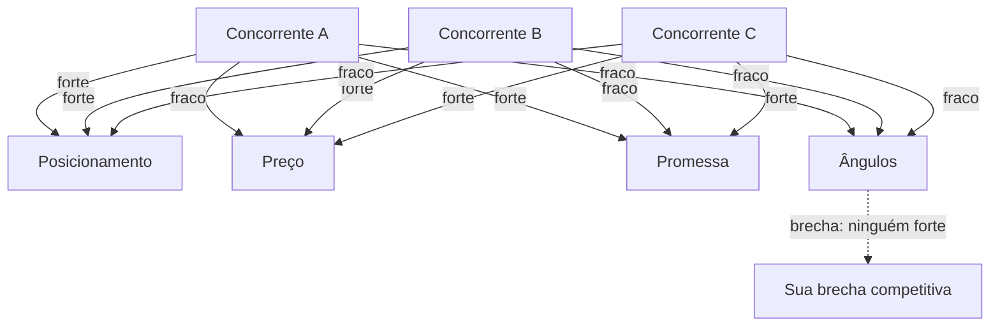

> **Para a instrutora (não lido ao vivo):** Energia da turma aqui costuma cair (já são 2h15 de aula). Comece com mini-recapitulação enérgica do que tem nas mãos (dor mapeada, mensagem testada). Use voz mais firme. Este bloco alimenta o bloco 4 diretamente, sem intervalo entre eles. Plano B se atrasar: cortar exercício intermediário, manter só o iniciante.

> **A tese deste bloco.** Concorrente bem analisado não é lista de empresas com seus preços. É mapa de 4 vetores que mostra onde TODOS estão fortes e onde NINGUÉM está. Esse "onde ninguém está" é sua brecha. Você vai sair daqui com um dossiê de concorrente em 15 minutos, e sabendo qual dos 4 vetores é seu campo de batalha.

Você provavelmente já fez análise de concorrente que virou planilha com 30 linhas e nenhuma decisão. Ou olhou site do concorrente, achou bonito, e ficou paralisado. Análise que não leva a decisão é tempo perdido. Análise que mostra brecha é mapa de tesouro. A Alan resume: o livro da oferta é o que diferencia, e ele se constrói olhando posicionamento, oferta, autoridade, avatar. Aqui a gente foca nos 4 vetores que diferem você do concorrente.

## Microestrutura deste bloco

```text
00-15 min  Teoria: 4 vetores e a busca de brecha
15-35 min  Demo ao vivo: dossiê de 1 concorrente em 15 minutos
35-45 min  Exercício em tela: você monta dossiê de seu concorrente
45-50 min  Quiz oral mais Q&A
```

## 01 · Teoria: 4 vetores e a busca de brecha (15 min)

A Alan extrai do offerbook dela 4 elementos que decidem como o cliente percebe a oferta: posicionamento, promessa (USP), ancoragem (preço) e história (ângulo). Aqui a gente usa esses 4 como vetores de análise competitiva. Cada concorrente tem força e fraqueza em cada vetor. Mapear os 4 lado a lado revela a brecha.

### Os 4 vetores

1. **Posicionamento.** Como o concorrente se vende. Qual identidade ele projeta. "Para quem é o pioneiro" é diferente de "para quem quer barato". O posicionamento aparece no slogan, nas categorias do site, nas fotos da equipe. Não é o que ele diz que é. É o que ele faz parecer ser.

2. **Preço (e ancoragem).** Quanto ele cobra, e como ele apresenta o preço. Preço sozinho mente. Preço com ancoragem ("de R$ X por R$ Y") mente diferente. Preço de assinatura comparado com one-shot conta outra história. A Alan diz: preço sem valor é ruído. Mapeie estrutura, não só número.

3. **Promessa (USP).** O que ele promete entregar. Quanto e em quanto tempo. Garantia ou sem garantia. Específica ou genérica. Promessa específica é mais forte. A Alan dá o exemplo do médico do estômago: "método de 30 segundos onde pessoas com queimação resolvem de forma simples" é promessa específica. "Cuidamos do seu estômago" é promessa genérica.

4. **Ângulos (história).** Por que o concorrente existe. Qual história ele conta. Origem do fundador, missão, problema que enxergou. A Alan diz: a história empacota tudo. Concorrentes podem ter mesmo posicionamento, mesmo preço, mesma promessa, e perder ou ganhar pela história.

> **Pergunta reflexiva:** dos 4 vetores, em qual seu concorrente principal é mais fraco? Se você não sabe, você não tem dossiê ainda. Tem palpite.

### A brecha competitiva



Brecha é vetor onde nenhum concorrente é forte. Você não precisa ser o melhor em tudo. Você precisa ser o único forte em UM vetor onde todos os outros são medianos. A Alan ataca isso com "mecanismo único", que vive entre promessa e história.

### Por que IA muda esse jogo

Antes, dossiê de concorrente exigia ler o site, baixar PDF de vendas, falar com ex-clientes, semanas de trabalho. A Alan conta que ela mandou o squad Research dela buscar preços de concorrentes e descobriu empresas cobrando seiscentos dólares por algo equivalente ao dela. Ela tomou decisão de preço com base nesse dado em minutos.

Hoje, com IA, o ciclo é:
- 5 minutos coletando material do site e canais públicos
- 8 minutos pedindo ao Claude para extrair os 4 vetores
- 2 minutos refinando e identificando a brecha

15 minutos por concorrente. Você analisa 4 concorrentes em uma hora.

> **Nota:** dossiê não substitui experiência de mercado. Substitui o achismo. Você ainda precisa de julgamento para interpretar o que a IA devolve. Mas chega na decisão muito mais rápido.

## 02 · Demo ao vivo com Claude (20 min)

> **Para a instrutora:** abra Claude. Vou colar 3 prompts encadeados que constroem o dossiê. Demo 18 minutos.

Vamos analisar um concorrente fictício mas baseado em padrão real: um software brasileiro de gestão para escritórios de contabilidade. Eu uso o nome "ContaPro" como placeholder. Antes da aula, recolhi material público do site, planos de preço e textos de redes. Cole junto comigo.

### Prompt 1: extrair posicionamento e promessa

```text
Você é um analista competitivo sênior. Vou colar abaixo material público de um concorrente. Sua tarefa:

1. Posicionamento: em 1 frase, como o concorrente se vende. Não use as palavras dele. Use sua interpretação ("ele se posiciona como ___ para ___").
2. Promessa (USP): qual é a promessa principal, em 1 frase. Marcar como específica ou genérica e explicar por quê.
3. Para quem ele NÃO serve: 2 perfis que ele explicitamente ou implicitamente exclui.

Material coletado:
[colar 200 a 500 palavras do site, página inicial, sobre nós, página de planos]
```

**Output esperado:** 3 itens curtos e diretos. Posicionamento em 1 frase. Promessa marcada como específica ou genérica. Lista de quem ele NÃO serve.

**O que comentar:** "Repare no item 3. Saber quem ele NÃO serve é mais útil que saber quem ele serve. Quem ele exclui é seu candidato a cliente."

### Prompt 2: extrair preço e estrutura de ancoragem

```text
Agora vou colar a estrutura de preços do mesmo concorrente. Sua tarefa:

1. Tabela de preços com colunas: Plano, Valor mensal, Valor anual, O que inclui em 1 linha
2. Estratégia de ancoragem: como ele guia o cliente a escolher o plano caro (riscado, comparativo, escassez, bônus). Marcar técnica usada.
3. Diferencial competitivo no preço: ele é mais caro, igual ou mais barato que a média de mercado? Como ele justifica?
4. Modelo de cobrança: mensalidade, anual, one-shot, performance. Qual e por quê.

Material:
[colar página de planos, política de upgrade, política de cancelamento]
```

**Output esperado:** tabela limpa de preços, técnica de ancoragem identificada, posição no mercado.

**O que comentar:** "A estrutura é mais reveladora que o número. Quem cobra anual com desconto está priorizando retenção. Quem cobra one-shot alto está priorizando margem. Estratégias opostas."

### Prompt 3: identificar ângulo e mapear brecha

```text
Última análise. Vou colar amostras de postagens em redes sociais, depoimentos de clientes e a página "Sobre" do concorrente.

1. Ângulo (história): qual história o concorrente conta sobre por que existe. Em 2 frases.
2. Ressonância emocional: a história ressoa em qual perfil decisório (racional, emocional, pragmático)? Por quê?
3. Mapa final dos 4 vetores: para cada vetor (posicionamento, preço, promessa, ângulo), marque a força do concorrente como Forte, Médio ou Fraco, e justifique em 1 frase.
4. Sugestão de brecha: qual vetor é o mais fraco e poderia virar seu campo de batalha?

Material:
[colar 10 posts, 5 depoimentos, página Sobre]
```

**Output esperado:** mapa final dos 4 vetores com força marcada e sugestão de brecha competitiva.

**O que comentar:** "A última pergunta é a que importa. Não interessa que ele é forte em posicionamento. Interessa onde ele é fraco. Aí está sua chance."

### Material para envio pós-aula (Codex / GPT)

Os 3 prompts adaptados para GPT:

```text
Atue como analista competitivo sênior. Vou colar material público de um concorrente. Devolva: posicionamento em 1 frase (sua interpretação), promessa marcada como específica ou genérica com justificativa, 2 perfis que ele NÃO serve.

Material: [colar]
```

```text
Análise de preço: tabela de planos com valor mensal, anual e inclusos em 1 linha. Estratégia de ancoragem usada (riscado, comparativo, escassez, bônus). Posição de preço no mercado. Modelo de cobrança e racional.

Material: [colar]
```

```text
Análise de ângulo e mapa final. Devolva: ângulo (história em 2 frases), perfil decisório que ressoa, mapa dos 4 vetores (posicionamento, preço, promessa, ângulo) com Forte, Médio ou Fraco para cada, e sugestão de brecha competitiva.

Material: [colar posts, depoimentos, página Sobre]
```

> **Diferença da versão Claude:** GPT tende a ser mais cauteloso em julgar "fraco". Reforce no prompt "seja direto, marque Fraco quando justificável, não tenha medo de tomar posição".

## 03 · Exercício em tela (10 min)

> **Para a instrutora:** anuncie os 2 níveis. 8 minutos.

### Nível iniciante

**Tarefa:** escolha 1 concorrente seu. Cole no Claude o prompt 1 com material do site dele. Receba posicionamento, promessa e exclusões.

```text
Você é analista competitivo. Material público abaixo. Devolva: posicionamento (1 frase, sua interpretação), promessa marcada como específica ou genérica, 2 perfis que ele NÃO serve.

[colar material]
```

**Output esperado:** 3 itens claros. Você sabe que funcionou se conseguir explicar em 30 segundos para alguém o posicionamento do concorrente sem olhar o site.

### Nível intermediário

**Tarefa:** rode os 3 prompts em sequência para 2 concorrentes diferentes. Compare os 4 vetores lado a lado. Identifique brecha onde os dois são fracos ou médios.

```text
[template completo: 2 concorrentes, 3 prompts cada, mapa comparativo dos 4 vetores]
```

**Critério de qualidade:** ao final, você consegue apontar 1 brecha defensável. Brecha defensável significa: você consegue argumentar por que aquele vetor é importante para o cliente E por que nenhum dos 2 concorrentes ataca. Se a brecha for "preço mais baixo", suspeite (preço mais baixo é fácil de copiar). Se for "história que ressoa em decisor emocional para nicho específico", é defensável.

## 04 · Quiz oral mais Q&A (5 min)

```quiz
question: "Você analisou 3 concorrentes. Os 3 têm posicionamento forte, promessa média, preço similar e ângulo fraco. Qual é a brecha?"
options:
  - id: a
    text: "Atacar com preço mais baixo, já que preço é vetor sem forte dominância."
    feedback: "Brecha de preço é a mais fácil de copiar. Em 30 dias um concorrente baixa também. Atacar preço quando há brecha em ângulo é estratégia de curto prazo."
    rationale: "Aluno escolhe preço por ser o mais visível, sem perceber a vulnerabilidade."
  - id: b
    text: "Atacar pelo ângulo. Os 3 são fracos nesse vetor, e ângulo (história) é o mais difícil de copiar porque é identidade."
    correct: true
    feedback: "Sim. Ângulo é o vetor mais defensável quando todos são fracos. História não se copia, só se contrafalsifica. Quem chega primeiro com história autêntica ganha posição que dura anos. A Alan diz: a história empacota tudo."
  - id: c
    text: "Atacar promessa, já que está como média e há espaço para subir."
    feedback: "Promessa é importante mas média não é fraca. Atacar onde há fraqueza generalizada é mais eficiente que atacar onde há mediana com margem."
    rationale: "Aluno confunde média com brecha. Brecha real é onde todos são fracos."
```

```quiz
question: "Seu concorrente cobra R$ 100 mil em modelo anual com 30% de desconto para pagamento à vista. Qual a leitura estratégica desse preço?"
options:
  - id: a
    text: "Ele está caro e desesperado por caixa imediato, daí o desconto."
    feedback: "Improvável. Desconto à vista em B2B alto ticket é prática padrão de gestão de fluxo, não sinal de desespero. Leitura mais provável está abaixo."
    rationale: "Aluno interpreta desconto como fraqueza, ignorando que é técnica de margem."
  - id: b
    text: "Ele prioriza margem de longo prazo e retenção. Cobra alto, oferece desconto para travar contrato anual e reduzir churn."
    correct: true
    feedback: "Sim. R$ 100 mil anual com desconto à vista é estratégia clássica de quem prioriza LTV sobre velocidade de aquisição. Você sabe que enfrentar com mensalidade barata atrai cliente diferente, não o mesmo cliente."
  - id: c
    text: "Ele tem custo operacional alto, daí o preço alto, ineficiência operacional."
    feedback: "Leitura possível, mas você não tem dados de custo para afirmar. Concorrente pode ter custo baixo e simplesmente extrair margem. Sem dado de margem real, não é leitura defensável."
    rationale: "Aluno infere ineficiência sem dado para sustentar."
```

```quiz
question: "Você mapeou 4 concorrentes nos 4 vetores. Todos têm posicionamento forte. Significa que esse vetor é um campo perdido para você?"
options:
  - id: a
    text: "Sim. Vetor com forte dominância generalizada é campo perdido, abandonar e focar em outros."
    feedback: "Não necessariamente. Forte dominância pode significar que todos disputam o MESMO posicionamento. Se você se posicionar diferente (não melhor, diferente), o vetor vira seu. A Alan ataca isso com mecanismo único."
    rationale: "Aluno trata força como concentração, sem perceber espaço lateral."
  - id: b
    text: "Não. Se todos disputam o mesmo posicionamento, há espaço lateral. Se posicionar diferente (não competir no mesmo eixo) abre território novo."
    correct: true
    feedback: "Sim. Forte dominância em um vetor pode significar que todos brigam pela mesma posição. Você pode mudar o eixo. Em vez de 'mais barato' ou 'mais premium', virar 'só para esse perfil específico'. Isso é reposicionamento por nicho, não por força bruta."
  - id: c
    text: "Significa que o vetor precisa de inovação tecnológica para diferenciar."
    feedback: "Tecnologia ajuda, mas posicionamento é narrativa, não tecnologia. A inovação aqui é de história, não de produto."
    rationale: "Aluno default para resposta de produto quando o jogo é de narrativa."
```

### Q&A guiado

- **P:** "E se meu concorrente tem dados que eu não tenho como cliente número e faturamento?"
  **R (30s):** Você não precisa dos dados internos dele. Você precisa do que ele EXPÕE: site, preço, posts, depoimentos. Os 4 vetores são todos analisáveis a partir de material público. Dado interno seria bônus, não requisito.

- **P:** "Quantos concorrentes vale analisar?"
  **R (30s):** Mínimo 3, máximo 5. Menos que 3 não dá padrão. Mais que 5 vira ruído. Pegue os 3 mais comparáveis ao seu posicionamento, mais 1 ou 2 adjacentes para olhar o entorno.

- **P:** "Como saber se o que o Claude marca como Fraco é realmente fraco?"
  **R (30s):** Compare com seu próprio julgamento depois de ler o material. Se discordar, peça ao Claude para justificar com 2 evidências do material. Se a justificativa for forte, atualize seu julgamento. Se for fraca, atualize o output. É diálogo, não ditado.

## Para o quadro

> **Sobre os 4 vetores:** posicionamento, preço, promessa, ângulo. Mapeie os concorrentes nos 4 e procure onde TODOS são fracos. Aí está sua brecha.

> **Sobre defesa:** brecha de ângulo é a mais difícil de copiar. Brecha de preço é a mais fácil de copiar.

> **Sobre tempo:** 15 minutos por concorrente. 4 concorrentes em uma hora. Antes da IA, eram semanas.

## Transição para o próximo bloco

> **Para a instrutora (frase-ponte):** "Você tem dor, mensagem e brecha. Agora vamos empilhar a oferta inteira em cima disso. Sem intervalo, porque o bloco 4 só faz sentido depois de você ter visto a brecha do bloco 3. Bora."

## Checklist pré-bloco

- [ ] Material público do concorrente fictício "ContaPro" carregado em arquivo (site, preços, posts)
- [ ] Claude aberto com janela limpa
- [ ] Material Codex/GPT pronto
- [ ] Cronômetro visível
