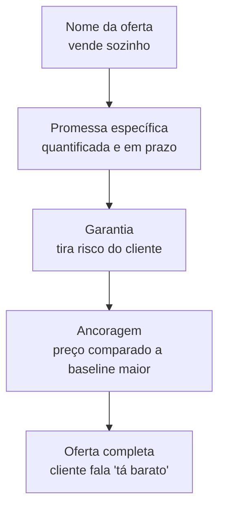

> **Para a instrutora (não lido ao vivo):** Bloco final de conteúdo. Energia alta porque é onde tudo se junta. A turma chega aqui depois de 3 blocos: tem dor, mensagem e brecha. Falta empacotar. Este é o bloco que vende a aula inteira para quem está em dúvida se valeu a pena. Demos precisam mostrar oferta nascendo na frente deles. Plano B se atrasar: cortar o exercício intermediário, manter só o iniciante, ir direto para o fechamento.

> **A tese deste bloco.** Preço sem valor é ruído. A Alan diz isso e a frase é cirúrgica. Sua oferta não vence porque cobra menos. Vence porque o cliente vê valor 10 vezes maior que o preço. Esse é o efeito Grand Slam: empilhar valor até o preço sumir na comparação. Você vai sair daqui com uma oferta completa, com promessa específica, garantia que tira risco, ancoragem que ajusta percepção, e nome que vende sozinho.

Você provavelmente já criou oferta que parecia boa e morreu no preço. Cliente disse "tá caro" e você baixou. Resultado: margem fina, cliente desconfiado, escala impossível. O caminho oposto é o que a Alan ensina: nunca baixar preço. Subir valor. Empilhar até o preço parecer barato. Este bloco é como fazer isso com IA, em menos de uma hora.

## Microestrutura deste bloco

```text
00-15 min  Teoria: regra 10x e os 4 componentes do empilhamento
15-35 min  Demo ao vivo: construir Grand Slam Offer do zero com Claude
35-45 min  Exercício em tela: você empilha sua oferta (2 níveis)
45-50 min  Quiz oral mais Q&A
```

## 01 · Teoria: regra 10x e os 4 componentes (15 min)

A Alan tem uma fórmula de precificação que é o oposto do que se ensina por aí: ela cobra um décimo do que entrega. Se a entrega vale R$ 500 mil, ela cobra R$ 50 mil. Se vale R$ 50 mil, cobra R$ 5 mil. Sempre 10 vezes acima.

A inversão pedagógica: você não pergunta "quanto cobrar". Pergunta "quanto isso vai gerar para o cliente". Aí divide por 10. Esse é seu preço.

> **Pergunta reflexiva:** sua oferta atual cobra quanto, e gera quanto para o cliente? Você consegue justificar a relação 1 para 10? Se não, ou o preço está alto ou a entrega é baixa.

A Alan dá um caso concreto: cliente dela apresentou projeto que economizava cerca de R$ 200 mil para a empresa. Ele cobrou R$ 22 mil. Relação aproximada de 1 para 10. Outro: projeto inicial cotado em R$ 20 mil virou R$ 120 a 180 mil quando ele apresentou a oferta empacotada, porque a empresa quis fechar tudo com ele em vez de fragmentar com 5 fornecedores. Mesmo trabalho. Empacotamento diferente. Preço 6 a 9 vezes maior.

### Por que a regra 10x funciona

Três razões:

1. **Margem para entregar bem.** Cobrar 10 vezes abaixo do valor te dá oxigênio para entregar com sobra. Cliente fica satisfeito, indica, retorna.
2. **Posição na mente do cliente.** Quem cobra um décimo do que entrega é visto como gerador de valor, não como custo. Custo se corta. Valor se mantém.
3. **Filtro de cliente.** Quem entende a relação compra. Quem não entende não é seu cliente. Você não precisa convencer quem não entende.

A Alan resume: eu não cobro dez vezes mais, eu entrego dez vezes mais.

### Os 4 componentes do empilhamento

Grand Slam Offer não é oferta com preço bom. É oferta com 4 componentes empilhados de forma que o cliente percebe valor crescente em cada camada.



1. **Promessa específica.** O que você entrega, em quanto, em qual prazo. A Alan dá o exemplo do médico: "método de 30 segundos onde pessoas com queimação resolvem de forma simples". 30 segundos. Tipo específico de pessoa. Resultado nomeado. Promessa genérica ("ajudamos empresas a crescer") é ruído. Promessa específica ("dobramos sua taxa de resposta em 60 dias ou devolvemos") é arma.

2. **Garantia.** Quem assume risco vende mais. A Alan vende projetos com garantia de retorno em 30 dias para a maioria dos casos. Garantia tira do cliente a desculpa de "e se não funcionar". Ela transfere o risco para você. Você pode dar isso porque a regra 10x te dá margem para devolver e ainda lucrar nos que ficam.

3. **Ancoragem.** Preço sozinho é só número. Preço com referência tem significado. Ancore comparando com: (a) o custo do problema (o que o cliente perde por mês sem resolver), (b) alternativas mais caras (consultoria tradicional, contratação de funcionário), (c) tempo equivalente em horas dele. Sem ancoragem, o cliente compara seu preço com expectativa interna dele. Com ancoragem, ele compara com o que você definiu.

4. **Nome da oferta.** Nome ruim mata oferta boa. Nome bom vende oferta mediana. A Alan cita "Cohort Fundamentos" como nome de produto dela. Nome diz o que é, para quem, em uma palavra ou duas. Nome genérico ("Treinamento Completo de IA") morre. Nome específico ("Cohort Fundamentos") sobrevive.

> **Nota:** os outros elementos do offerbook da Alan (autoridade, avatar, mecanismo único, história, bônus) também importam. Aqui a gente foca nos 4 que fazem a diferença mais visível no momento de fechar. Os outros enriquecem.

## 02 · Demo ao vivo com Claude (20 min)

> **Para a instrutora:** abra Claude. 3 prompts encadeados que constroem a oferta. Use a frase do cliente do bloco 1, a persona do bloco 2 e a brecha do bloco 3 como insumos. Demo 18 minutos.

Vamos construir uma oferta inteira para o caso do escritório de contabilidade. Dor mapeada no bloco 1 (perder cliente por demora na resposta). Persona testada no bloco 2 (sócia racional com pressão de comitê). Brecha do bloco 3 (concorrentes fracos em ângulo de história).

### Prompt 1: gerar promessa específica a partir do que temos

```text
Você é um copywriter sênior especialista em ofertas de alto ticket B2B. Vou te dar 3 insumos que vieram de pesquisa estruturada. Sua tarefa é construir UMA promessa específica para a oferta.

Insumo 1, dor verbatim do cliente: "Perdi três clientes esse mês porque a equipe demorou mais de duas horas para responder. O sócio está me cobrando na reunião de sexta."

Insumo 2, persona-alvo: sócia de escritório de contabilidade de médio porte (R$ 200 mil a R$ 1 milhão de faturamento anual), perfil decisor racional, exige ROI quantificado, decide em comitê.

Insumo 3, brecha competitiva: concorrentes mapeados têm posicionamento e promessa fortes, mas ângulo (história) fraco. Espaço para ofertar com angular distinto.

Sua tarefa:
1. Escreva 3 versões de promessa específica, cada uma com: o resultado nomeado, a quantificação, o prazo, o "ou" (devolução, dobra, refaz).
2. Para cada versão, marque qual perfil decisório ela ataca melhor (racional, emocional, pragmático).
3. Recomende qual usar dado que o perfil-alvo é racional.
```

**Output esperado:** 3 promessas, classificação por perfil, recomendação. A vencedora deve quantificar resultado, prazo e ter cláusula de devolução ou refazimento.

**O que comentar:** "A promessa é o coração. Sem ela, o resto não sustenta. Repare como o prompt obriga o Claude a escolher, não a sugerir. Sugestão paralisa, escolha avança."

### Prompt 2: construir garantia e ancoragem

```text
Com a promessa escolhida ("[colar a vencedora]"), agora construa garantia e ancoragem.

Garantia:
1. Proponha 2 versões de garantia: uma forte (devolução total se não bater meta), uma híbrida (devolução parcial mais 30 dias extras).
2. Para cada, identifique o risco que você assume e como mitigar operacionalmente.
3. Recomende qual usar para uma oferta de R$ 50 mil reais com perfil B2B racional.

Ancoragem:
1. Calcule 3 ancoragens diferentes para um preço de R$ 50 mil:
   - Ancoragem por custo do problema (quanto o cliente perde por mês sem resolver, baseado em "3 clientes perdidos por mês a R$ 5 mil de receita média mensal cada um")
   - Ancoragem por alternativa (contratar gerente de operações sênior por R$ 12 mil mensais)
   - Ancoragem por horas dele (quantas horas de sócia ela ganha de volta por mês, valorando hora em R$ 500)
2. Para cada, escreva a frase de ancoragem que aparece no material de vendas.
3. Recomende qual usar como ancoragem principal.
```

**Output esperado:** garantia escolhida com mitigação operacional, 3 ancoragens calculadas, frase pronta de cada uma, recomendação.

**O que comentar:** "Repare que estou dando o número da dor que veio do bloco 1 (3 clientes perdidos a R$ 5 mil cada). Ancoragem com número real é diferente de ancoragem com número chutado. Pesquisa do bloco 1 vira insumo aqui."

### Prompt 3: nomear a oferta

```text
Você tem agora:
- Promessa: "[colar]"
- Garantia: "[colar]"
- Ancoragem: "[colar]"
- Persona-alvo: sócia de escritório de contabilidade médio porte, decisor racional
- Brecha competitiva: ângulo (história) único

Sua tarefa: gerar 5 nomes candidatos para esta oferta seguindo critérios:
1. Diz para quem é em 1 ou 2 palavras
2. Sugere o resultado, não o método
3. Memorizável em uma leitura
4. Funciona como assunto de e-mail e como título de página
5. Não é genérico (evitar "Sistema de", "Programa de", "Método")

Para cada nome, dê justificativa em 1 frase do porquê funciona. Recomende o vencedor com argumento de 2 frases.
```

**Output esperado:** 5 nomes com justificativa, recomendação fundamentada.

**O que comentar:** "Nome ruim morre na hora. Nome bom dura anos. A Alan diz que é o que diferencia o Zoom dela de outras lives, a forma como ela estruturou o livro da oferta, e o nome dele é parte disso. Vale gastar 5 minutos a mais aqui."

### Material para envio pós-aula (Codex / GPT)

```text
Construa 3 versões de promessa específica para oferta B2B alto ticket. Insumos: dor verbatim, persona-alvo (decisor racional), brecha (ângulo). Para cada versão: resultado nomeado, quantificação, prazo, cláusula "ou". Classifique por perfil decisório. Recomende para racional.

Insumos:
- Dor: [colar]
- Persona: [colar]
- Brecha: [colar]
```

```text
Para a promessa escolhida, gerar garantia e ancoragem. Garantia: 2 versões (forte e híbrida) com risco assumido e mitigação. Ancoragem: 3 cálculos (custo do problema, alternativa, horas do cliente) com frase pronta de cada. Recomendar.

Promessa: [colar]
Preço alvo: [colar]
Números do bloco 1: [colar]
```

```text
Gerar 5 nomes para a oferta seguindo 5 critérios (diz para quem é, sugere resultado, memorizável, funciona como e-mail e título, não genérico). Justificativa em 1 frase. Recomendação com 2 frases.

Insumos completos: [colar promessa, garantia, ancoragem, persona, brecha]
```

## 03 · Exercício em tela (10 min)

> **Para a instrutora:** anuncie os 2 níveis. 8 minutos. Esta é a entrega final que cada aluno vai sair com algo concreto.

### Nível iniciante

**Tarefa:** rode só o prompt 1 com sua dor, persona e brecha (mesmo que aproximados). Escolha 1 das 3 promessas geradas.

```text
Construa 3 promessas específicas para minha oferta. Cada uma com: resultado, quantificação, prazo, "ou". Classificar por perfil decisório. Recomendar para [perfil].

Dor: [sua]
Persona: [sua]
Brecha: [sua]
```

**Output esperado:** 1 promessa escolhida. Você sabe que funcionou se conseguir falar a promessa em voz alta e ela soar como contrato, não como propaganda.

### Nível intermediário

**Tarefa:** rode os 3 prompts em sequência. Sai com oferta completa: promessa, garantia, ancoragem, nome. Verifique a regra 10x: o valor que sua oferta gera é 10 vezes o preço que você vai cobrar?

```text
[template completo: 3 prompts encadeados, calcular regra 10x ao final]
```

**Critério de qualidade:** a oferta final passa em 3 testes:
1. **Teste da especificidade.** Você consegue ler em voz alta sem precisar explicar. Cliente do nicho entende em 5 segundos.
2. **Teste da regra 10x.** O valor que sua oferta gera é pelo menos 10 vezes o preço cobrado. Você consegue justificar com número.
3. **Teste do nome.** Você manda o nome por mensagem para 2 pessoas do nicho. Se 1 das 2 perguntar "o que é isso?", o nome está ruim. Se as 2 entenderem, está bom.

## 04 · Quiz oral mais Q&A (5 min)

```quiz
question: "Sua oferta cobra R$ 30 mil e você calcula que entrega valor de R$ 80 mil para o cliente. Aplique a regra 10x e diga o que falta."
options:
  - id: a
    text: "A relação é boa, 1 para 2,5, pode lançar como está."
    feedback: "A regra 10x exige 1 para 10. Você está em 1 para 2,7. Faltam 2 caminhos: ou aumenta a entrega para chegar perto de R$ 300 mil de valor gerado, ou reduz o preço para R$ 8 mil. A Alan recomenda aumentar a entrega, não reduzir o preço."
    rationale: "Aluno aceita a relação atual sem confrontar com a regra 10x."
  - id: b
    text: "Faltam ou bônus que elevem entrega para R$ 300 mil de valor, ou reduzir preço para R$ 8 mil. Recomendação: subir entrega, não baixar preço."
    correct: true
    feedback: "Sim. A regra 10x não é flexível. Se você está em 1 para 2,7, escolhe um dos dois caminhos. Subir entrega é melhor porque preserva margem e posição no mercado. Bônus, garantia mais forte, prazo de execução, suporte estendido, são todos caminhos para subir entrega."
  - id: c
    text: "A regra 10x é orientação, não regra. 1 para 2,5 já é bom em B2B."
    feedback: "A Alan é taxativa: ela cobra um décimo do que entrega. Não é orientação, é mecanismo. Você pode escolher não seguir, mas perde o efeito Grand Slam."
    rationale: "Aluno relativiza a regra para acomodar oferta abaixo do padrão."
```

```quiz
question: "Você tem promessa específica, garantia forte, ancoragem por custo do problema. Falta o nome. Qual destes nomes funciona melhor para uma oferta B2B para sócios de escritório de contabilidade?"
options:
  - id: a
    text: "Sistema de Otimização de Atendimento Contábil 360"
    feedback: "Genérico e longo. 'Sistema de' é um dos termos que a regra desencoraja. '360' não diz nada concreto. Cliente não vai memorizar."
    rationale: "Aluno escolhe nome que parece profissional mas é vazio."
  - id: b
    text: "Resposta 60. Programa que dobra a velocidade de resposta do seu escritório em 60 dias."
    correct: true
    feedback: "Sim. 'Resposta 60' diz o resultado (resposta) e o prazo (60). Funciona como assunto de e-mail. Cliente lê uma vez e lembra. A linha descritiva ancora. Atende os 5 critérios."
  - id: c
    text: "ContaAgile, a solução completa para gestão moderna de escritórios."
    feedback: "Nome inventado que parece marca de produto, mas não diz resultado. 'Solução completa' e 'gestão moderna' são vazios. Não passa no teste do nicho."
    rationale: "Aluno escolhe nome bonito mas inespecífico."
```

```quiz
question: "Sua oferta foi para teste com 3 personas (bloco 2) e ressoou nas 3. Você está pronto para lançar?"
options:
  - id: a
    text: "Sim. Ressonância nas 3 personas é sinal verde."
    feedback: "Atenção. Lembre do quiz do bloco 2: ressonância nos 3 perfis pode ser sinal de excelência ou de genérico. Antes de lançar, teste se a oferta diz algo específico ou se é universal."
    rationale: "Aluno toma sinal positivo como conclusão sem o teste de especificidade."
  - id: b
    text: "Quase. Antes de lançar, faça o teste do nome com 2 pessoas do nicho real (não persona), e o teste da regra 10x com cálculo de valor."
    correct: true
    feedback: "Sim. Persona sintética testa mensagem, mas a oferta final passa por mais 2 portas: teste com cliente real (não simulado) para o nome, e cálculo da regra 10x para o preço. Os três juntos te dão segurança para lançar."
  - id: c
    text: "Não. Faltam outros componentes do offerbook (autoridade, avatar, mecanismo único) antes de lançar."
    feedback: "Esses componentes enriquecem mas não bloqueiam. Com promessa, garantia, ancoragem e nome, você pode lançar uma versão. Os outros componentes você adiciona em ciclos seguintes."
    rationale: "Aluno espera oferta perfeita em vez de oferta lançável."
```

### Q&A guiado

- **P:** "E se eu não consigo cobrar 10x menos do que entrego porque meu nicho tem preço de mercado fixo?"
  **R (30s):** Provavelmente você está olhando o preço de mercado de uma categoria mais ampla. Se você fizer uma sub-oferta dentro da categoria com promessa específica (não a categoria inteira), você sai da comparação direta de preço. A regra 10x volta a funcionar.

- **P:** "Como dar garantia forte se eu sou novo no nicho e não tenho histórico?"
  **R (30s):** Garantia híbrida: devolução parcial mais ciclo extra grátis. Você assume risco menor que o de devolução total, mas ainda sinaliza confiança. Conforme acumula casos, migra para garantia forte.

- **P:** "Vale ter mais de uma oferta para o mesmo nicho?"
  **R (30s):** Sim, mas com cuidado. Cada oferta precisa de promessa, garantia, ancoragem e nome próprios. Duas ofertas no mesmo nicho com promessas parecidas se canibalizam. Diferencie pelo perfil decisório (uma para racional, outra para emocional).

## Para o quadro

> **Sobre preço: regra 10x.** Você cobra um décimo do que entrega. Se não passa nessa relação, sobe entrega ou baixa preço, não inventa relação.

> **Sobre empilhamento: 4 componentes.** Promessa específica mais garantia que tira risco mais ancoragem que dá referência mais nome que vende. Os 4 juntos fazem o preço sumir.

> **Sobre nome: vende sozinho ou morre sozinho.** Genérico morre. Específico sobrevive.

## Transição para o fechamento

> **Para a instrutora (frase-ponte):** "Você tem tudo nas mãos: dor mapeada, mensagem testada, brecha identificada e oferta empilhada. No fechamento, eu vou comprimir o que você precisa lembrar uma semana depois e te dar a ação concreta para amanhã. Bora fechar."

## Checklist pré-bloco

- [ ] Frase do cliente, persona escolhida e brecha competitiva acessíveis para colar
- [ ] Claude aberto, janela limpa
- [ ] Material Codex/GPT pronto
- [ ] Cronômetro visível
