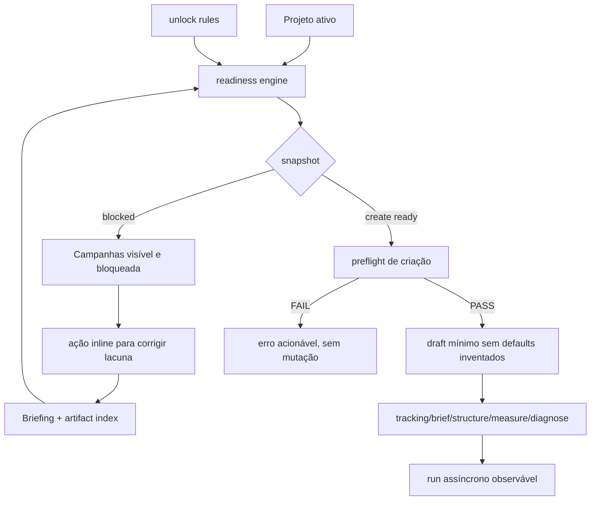

# ADR-002 — Gate de prontidão para campanhas

**Status:** Accepted for implementation via EPIC-12 (conditions recorded below)  
**Data:** 2026-07-16  
**Accountable/operator:** Pedro Valério  
**Repositório:** `cohort-de-marketing` (Studio privado)

## Contexto

A superfície de Campanhas está acessível mesmo quando o projeto ainda não tem
briefing, artefatos ou contratos suficientes para executar uma skill de tráfego.
O fluxo atual permite criar um draft e navegar para etapas que dependem de dados
ausentes. A falha aparece tarde, com mensagens genéricas, e o operador não sabe
qual ação destrava o fluxo.

Evidências usadas no desenho:

- `apps/academia-lendaria-ads-studio/src/components/unified-shell.tsx` expõe
  Campanhas sem consultar prontidão.
- `src/components/project-campaigns.tsx` cria campanha sem preflight e usa
  defaults de fallback.
- `src/lib/use-create-campaign.ts` grava `ads_campaigns` antes de validar os
  requisitos do projeto.
- `src/lib/campaign-plan.ts` fabrica awareness, dor, budget e tracking quando o
  dado de origem não existe.
- `src/lib/readiness.ts` já calcula campos, artefatos, status e próxima ação,
  mas não é usado pelo módulo de Campanhas.
- `data/skill-unlock-rules.json` é a fonte declarativa dos requisitos das
  skills Zelador, Briefista, Estruturador, Leitor e Diagnosticador.

## Decisão

Implementar um gate de campanha em cinco ondas, reutilizando o motor de
readiness existente e adicionando defesa em profundidade. O gate é avaliado por
capability, e não por um booleano global: `campaign.create` controla a criação
do draft mínimo; `campaign.tracking`, `campaign.brief`, `campaign.structure`,
`campaign.measure` e `campaign.diagnose` controlam as etapas posteriores.

1. **Readiness de domínio:** uma função pura transforma projeto, briefing,
   artifact index e regras em um snapshot versionado e explicável.
2. **Preflight em duas camadas:** W1 faz o preflight no cliente para feedback
   imediato; W4 adiciona a mesma validação no servidor. A transação e a
   idempotência da criação são materializadas pela story DB `12.W4.2`; antes
   desse ponto o preflight de cliente não é tratado como fronteira de segurança.
3. **UX orientada a reparo:** Campanhas continua visível, porém mostra estado
   bloqueado, checklist de lacunas e ações que levam ao campo correto dentro da
   mesma jornada.
4. **Execução observável:** cada run mostra fase, progresso determinado ou
   indeterminado, último evento, retry/cancelamento e erro classificado,
   estendendo o runtime durável já existente.
5. **Convergência:** o wizard novo e a rota legada usam o mesmo preflight,
   contrato de erro e estado durável; nenhum caminho bypassa o gate.

## Contrato de prontidão

```ts
type CampaignReadinessState = 'blocked' | 'ready_with_warnings' | 'ready'

type CampaignCapability =
  | 'campaign.create'
  | 'campaign.tracking'
  | 'campaign.brief'
  | 'campaign.structure'
  | 'campaign.measure'
  | 'campaign.diagnose'

interface CampaignReadinessSnapshot {
  contractVersion: 'campaign-readiness.v1'
  target: CampaignCapability
  state: CampaignReadinessState
  capability: {
    allowed: boolean
    label: string
    skillId?: string
  }
  blocking: Array<{
    code: string
    label: string
    source: 'briefing' | 'artifact' | 'skill' | 'tracking'
    field?: string
    artifactType?: string
    action: { kind: 'inline' | 'briefing' | 'journey'; target: string }
  }>
  warnings: Array<{ code: string; label: string; source: string }>
  satisfied: Array<{ code: string; label: string; source: string }>
  nextAction: { label: string; target: string } | null
  inputFingerprint: string
  sourceRevision: number | null
  computedAt: string
}
```

Regras do contrato:

- `blocked` é fail-closed para a capability consultada. Só o snapshot de
  `campaign.create` impede a criação; bloqueios das capabilities posteriores
  mantêm o draft mínimo válido, mas impedem a etapa correspondente.
- `ready_with_warnings` permite criar somente quando não há bloqueador; warnings
  são visíveis e não são convertidos em defaults.
- Ausência de dado permanece ausente (`null`/`missing`), nunca recebe texto ou
  número inventado.
- A lista de requisitos vem de `data/skill-unlock-rules.json`; a UI não replica
  a regra em condicionais locais.
- `sourceRevision` permite detectar snapshot obsoleto antes de executar.
- `inputFingerprint` cobre projeto, revisão do briefing, artifact index e
  versão/hash das unlock rules. `computedAt` é informativo e não altera a
  identidade do snapshot.

O mapeamento declarativo em `data/campaign-readiness-capabilities.json` é:

| Capability | Fonte canônica |
|---|---|
| `campaign.create` | regra estrutural local: projeto ativo e nome válido; não é uma skill |
| `campaign.tracking` | skill `zelador` + requisitos públicos correspondentes |
| `campaign.brief` | skill `briefista` + requisitos públicos correspondentes |
| `campaign.structure` | skill `estruturador` + requisitos públicos correspondentes |
| `campaign.measure` | skill `leitor-de-metricas` + requisitos públicos correspondentes |
| `campaign.diagnose` | skill `diagnosticador` + requisitos públicos correspondentes |

Assim Zelador não fica bloqueado por requisitos exclusivos do Briefista e a UI
não inventa uma capability `foundation` que colapse etapas independentes.

## Fluxo



## Opções consideradas

| Opção | Vantagem | Risco | Decisão |
|---|---|---|---|
| A. Esconder Campanhas até completar briefing | Evita clique inválido | Descoberta ruim; operador não entende o que falta | Rejeitada |
| B. Permitir campanha e falhar dentro do wizard | Alteração pequena | Erro tardio, drafts quebrados e defaults falsos | Rejeitada |
| C. Campanhas sempre visível + readiness/preflight compartilhado | Feedback cedo, reparo guiado e defesa server-side | Exige contrato e migração do legado | **Adotada** |

## Invariantes

1. Campanha bloqueada para `campaign.create` não gera `ads_campaigns`,
   `campaign_plan` nem run; bloqueios posteriores não invalidam o draft mínimo.
2. Nenhum dado ausente é substituído por fallback sem proveniência.
3. Draft continua draft; nenhuma mutação Meta é introduzida.
4. A mesma função de snapshot decide navegação, criação e execução para cada
   capability; não existe um booleano global duplicado.
5. A rota legada não pode contornar o preflight.
6. Estado de execução terminal é durável e recuperável após reload/restart.
7. Mensagens não expõem tokens, paths absolutos ou payloads sensíveis.

## Observabilidade e erros

Erros são classificados em `READINESS_BLOCKED`, `STALE_READINESS`,
`RUN_FAILED`, `RUN_CANCELLED` e `RUN_TIMEOUT`. Cada erro contém código,
mensagem humana, ação recomendada e correlation id sanitizado. Execuções sem
progresso determinável usam estado indeterminado explícito; não exibem um
percentual fictício.

## Estratégia de validação

- Testes unitários do snapshot e da tabela de requisitos.
- Testes de componente para navegação bloqueada, ações inline, loader e erro.
- Testes de integração para preflight atômico e enforcement no servidor.
- Regressão das rotas nova e legada.
- Playwright desktop/mobile com projeto incompleto, projeto pronto, snapshot
  obsoleto, falha, retry, cancelamento e reload.
- Lint, typecheck, testes completos e build do app.

## Limites

Esta ADR não publica campanhas, não altera a Meta, não cria nova skill e não
substitui as regras públicas. A fonte declarativa continua sendo o catálogo
canônico; o Studio consome uma cópia versionada e valida a versão.
