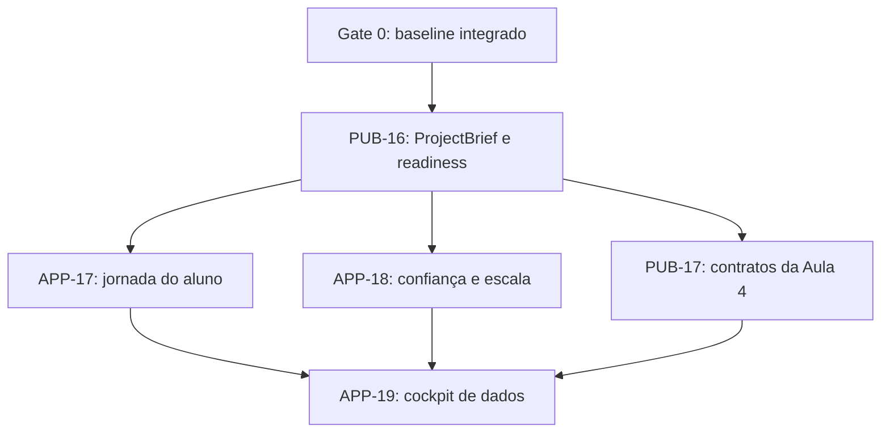

# Roadmap 2026 - Projeto canônico, jornada e ciclo de dados

## Status

Proposed. A direção foi aprovada pelo operador para materialização em
2026-07-14. Implementação permanece bloqueada até o Gate 0 e os sign-offs de
produto, arquitetura e QA de cada epic.

## Overview

Este programa conecta a distribuição pública `cohort-de-marketing` ao produto
privado `academia-lendaria-ads-studio` por contratos versionados, sem transformar
um repositório em dependência de filesystem do outro. O público continua sendo
a fonte de skills, ProjectBrief, catálogo, unlock rules e contratos da Aula 4;
o privado persiste, executa, revisa e apresenta esses contratos.

O core flow alvo é: preparar um projeto, receber a próxima skill explicável,
executar e revisar artefatos, operar campanhas manualmente, registrar semanas e
aprender com a relação entre decisão e resultado observado.

## Architecture Decision

Três alternativas foram consideradas:

| Opção | Descrição | Performance | Complexidade | Manutenção e escala |
|---|---|---|---|---|
| A | Evoluir somente o repositório público | Leve e local | Menor | Não entrega persistência nem jornada do Studio |
| B | Evoluir somente o Studio privado | Boa no app | Média | Cria fork dos contratos e drift de distribuição |
| C | Contrato público primeiro, experiência privada depois | Permite projeções privadas | Maior coordenação inicial | Preserva fonte de verdade e escala por interfaces |

Decision: **C, contract-first entre repositórios**. A complexidade de coordenação
é aceita para evitar dois modelos de projeto, duas semânticas de readiness e uma
Aula 4 que funcione apenas dentro do produto privado.

## Architecture



Não existe import por path entre os repositórios. Integração ocorre por release,
schema versionado, manifesto/hash e fixtures públicas. O Studio pode gerar tipos
ou adapters a partir da release aprovada, preservando a versão consumida.

## Components

- **Public contract layer**: mantém ProjectBrief, skill catalog, unlock rules,
  CampaignPlan, WeeklyPanel e ledger em formatos redistribuíveis e validados.
- **Public student surfaces**: briefing, mapa, guias e helpers CLI que funcionam
  em checkout limpo sem Supabase ou código privado.
- **Private persistence layer**: repositories e stores com workspace boundary,
  revisão, idempotência e projeções específicas por superfície.
- **Private execution and review layer**: jobs, event stream, artefatos e decisões
  humanas, preservando cancelamento durável e promoção atômica já entregues.
- **Data learning layer**: séries conscientes de qualidade, timeline de
  experimentos e proposta de alavanca única, sempre sujeita a decisão humana.
- **Evidence and release gates**: validators, fixtures, E2E e scans que impedem
  claims narrativos de conclusão sem prova reproduzível.

## Data Flow

### Project flow

```text
ProjectBrief v1 -> artifact index -> readiness -> skill run
  -> proposal/artifact -> human review -> campaign/weekly operation
```

### Learning flow

```text
CampaignPlan + WeeklyPanel + confirmed sources -> weekly ledger
  -> quality-aware series -> decision/outcome diagnosis
  -> single-lever proposal -> human decision -> next observed week
```

Dados viajam por contratos versionados. Métricas mantêm selo, fonte, janela,
premissa e confirmação. Conteúdo pesado de artefato e proposal é carregado sob
demanda; índices e timelines usam projeções mínimas.

## Integration

As integrações são contratuais e unidirecionais por operação: releases públicas
fornecem schemas, manifests e fixtures; o Studio consome uma versão explícita e
persiste apenas no boundary autorizado. Serviços externos entram por adapters
nomeados, com autenticação fora dos artefatos e falha fechada para versão,
identidade, autorização ou proveniência desconhecida.

### Public to private

- ProjectBrief, catálogo e regras são consumidos por versão e hash.
- Fixtures públicas formam contract tests do Studio.
- Mudança incompatível exige nova versão e story de migração.
- O privado não grava em arquivos canônicos do repositório público.

### Private to public

- O Studio pode devolver evidência sanitizada de paridade e uso real.
- Nenhum asset, ID privado, PII, segredo ou path absoluto entra na distribuição.
- Correções genéricas são publicadas por release governada, não copiadas ad hoc.

### External systems

- Supabase permanece boundary privado de persistência e autorização.
- Meta permanece read-only para coleta suportada; publicação e mutação são humanas.
- Checkout e caixa entram inicialmente como fontes declaradas e confirmadas, sem
  captura de PII de comprador.

## Configuration

Valores mutáveis não ficam hardcoded em componentes. Cada repositório valida sua
configuração local, e defaults públicos não incluem credenciais ou IDs privados.

```yaml
project_contract:
  schema_version: "1.0.0"
  unknown_version_policy: "reject"

runtime_governance:
  stream:
    primary: "sse"
    fallback: "polling"
  retention:
    policy_version: "1"

data_loop:
  missing_metric_policy: "preserve_missing"
  decision_authority: "human"
  meta_mutation: false
```

Cada parameter/option operacional terá schema, default, owner e regra de
override. Segredos continuam em environment variables locais e nunca no
ProjectBrief ou nos YAMLs versionados.

## Deployment

- O repositório público é distribuído como clone-and-run e validado em checkout
  limpo, com mirrors e manifests equivalentes.
- O Studio privado continua local-first, com build web/server e Supabase local
  no caminho suportado.
- Releases públicas precedem adapters privados quando o contrato muda.
- Nenhum deploy é autorizado por estes documentos; DevOps mantém autoridade de
  push, PR, merge e release.

## Security

- Workspace/RLS e identidade autoritativa protegem persistência privada.
- Intake, jobs e evidências passam por minimização e redaction antes de persistir
  ou exportar conteúdo sensível.
- Paths absolutos, traversal, symlink escape e schema desconhecido falham fechado.
- Decisão humana não pode ser inferida de proposal, recomendação ou evento Meta.
- Dados de comprador não são requisito para o ledger ou cockpit.

## Performance

- APP-18 mede queries, bytes, latência e writes antes de definir thresholds.
- UI usa projeções por caso de uso; conteúdo pesado é on-demand.
- SSE é canal primário, com polling somente como fallback observável.
- Journal evita read-modify-write crescente e preserva recovery/terminal CAS.
- Thresholds só bloqueiam após baseline e aprovação de arquitetura/QA.

## Monitoring

- Correlation IDs conectam request, project, job, artifact e event sem PII.
- Métricas cobrem hidratação, stream/failover, journal, recovery e erro.
- Alertas não contêm payload bruto e apontam para IDs sanitizados.
- Gates registram versão, hash, ambiente, veredito e blockers residuais.

## Testing

- Unit: schemas, migrações, readiness, séries e regras de decisão.
- Integration: repository/RLS, intake, jobs, events, retention e redaction.
- Contract: fixtures públicas executadas pelo Studio privado.
- E2E: jornada completa e data loop em desktop/mobile, incluindo recovery.
- Operational: operador real sem assistência e dataset real sanitizado.
- Release: mirrors, manifests, privacy scan e checkout limpo.

## Risks and Mitigations

| Risk | Impacto | Mitigation |
|---|---|---|
| Drift entre público e privado | Estados e outputs contraditórios | Release versionada, hash e contract tests |
| Capability loss durante unificação | Regressão de fluxos já aprovados | Baseline dos Epics 8-16 e gates de não regressão |
| Evidência armazenar PII/segredo | Incidente de privacidade | Minimização antes da persistência, corpus sintético e scan |
| Otimização quebrar recovery | Estado terminal incorreto | Fault injection e preservação explícita dos planos 001-005 |
| Série histórica com falsa precisão | Decisão de negócio errada | Fonte, janela, selo e missing preservados no contrato |
| Planejamento virar big bang | Prazo e validação tardia | Ondas, fan-in explícito e piloto por core flow |
| CI externo indisponível | Gate remoto inconclusivo | Gate local equivalente documentado, sem falso PASS |

## Sequence

1. `gate-0`: consolidar branches, correções e gates já implementados.
2. `PUB-16`: tornar ProjectBrief v1 a fonte canônica de projeto.
3. `APP-17`: fechar a jornada operacional para não desenvolvedores.
4. `APP-18`: preparar runtime, evidências e persistência para escala.
5. `PUB-17`: materializar contratos e conteúdo da Aula 4.
6. `APP-19`: fechar o ciclo de dados no Studio.

`APP-17` e `APP-18` podem executar em paralelo depois que `PUB-16.W1.1` congelar
o contrato v1. `APP-19` é fan-in de `APP-17`, `APP-18` e `PUB-17`.

## Non-negotiables

- CLI first para validação, migração e diagnóstico.
- Skills públicas canônicas em `.claude/skills/` e mirror literal em `.agents/skills/`.
- Nenhuma perda de capacidade dos Epics 8-16 já concluídos.
- Nenhum segredo, PII, path absoluto ou asset privado em evidências públicas.
- Métrica sem fonte, janela e confirmação não vira série histórica.
- Publicação, pausa, escala e mutação na Meta permanecem humanas.
- Nenhum epic muda para `InProgress` sem story, testes definidos e File List.

## Sign-offs

| Perspectiva | Estado | Evidência |
|---|---|---|
| Operador | Materialização aprovada | pedido de 2026-07-14 |
| Product Owner | pendente | revisar valor, escopo e prioridade |
| Architect | pendente | revisar contratos, boundaries e acoplamento |
| QA | pendente | validar matriz de evidências antes do primeiro código |
